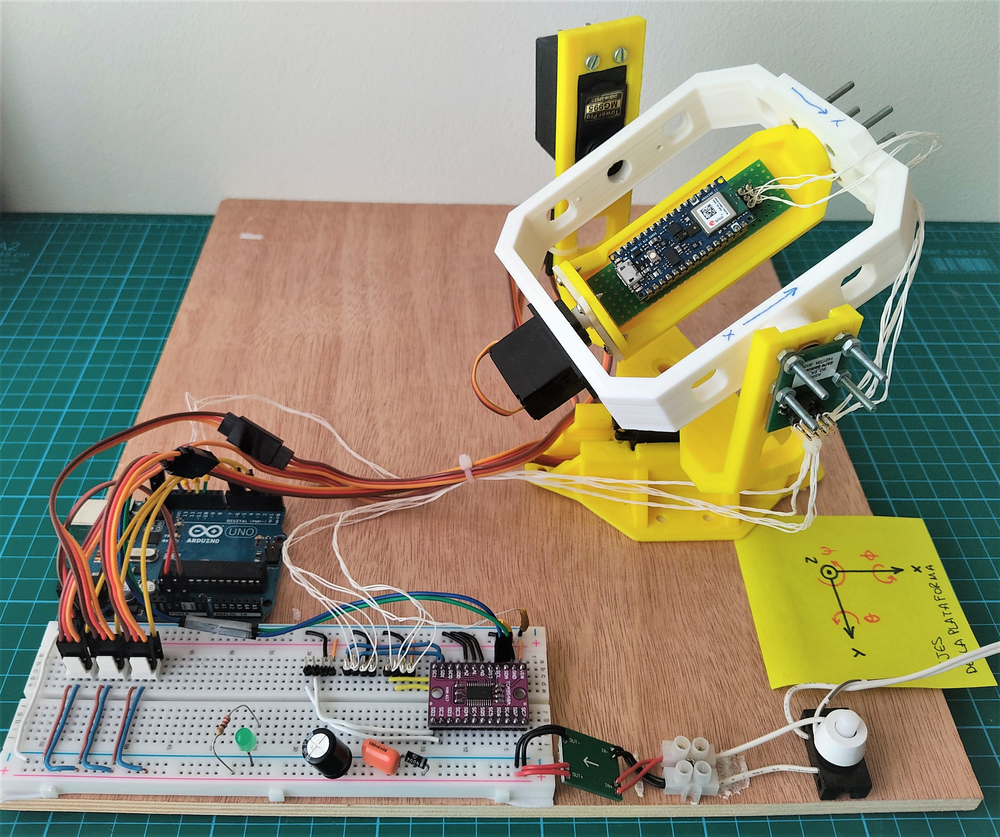
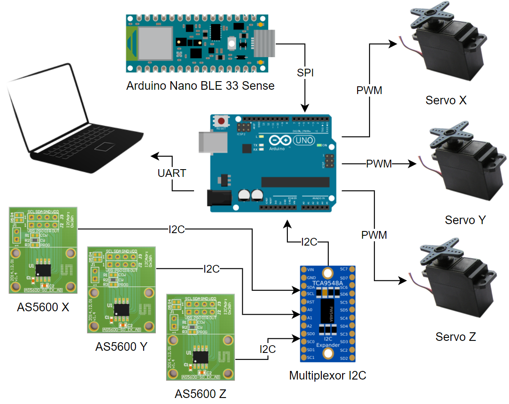

# GimbalPlatform

This repository contains the code and design files for the Gimbal Platform, developed as part of a bachelor's degree final project. The project aims to evaluate inertial orientation systems using a gimbal platform that can rotate an Inertial Measurement Unit (IMU) in a controlled manner. This setup allows for the generation of datasets to compare different orientation estimation algorithms quantitatively.

The platform structure 3D model is available on https://www.thingiverse.com/thing:4964323

## Project Structure

The repository is organized as follows:

- **designs**: Contains the 3D design files and the electrical for the platform components.

- **arduino**: Contains the Arduino source codes for controlling the platform and the IMU.

- **matlab**: Contains the Matlab scripts and functions used for data processing and algorithm comparison. It also includes datasets with the measurements recorded during tests. 

- **pictures**: Contains images of the platform and experimental setup.

## Setup Details

The hardware setup for this project involves two key components: the Arduino Nano BLE33 Sense and the Arduino UNO.

The Arduino Nano BLE33 Sense contains and 9-DOF IMU (Inertial Measurement Unit) which collect data of linear acceleration, angular velocity and magnetic field. This raw data is acquired through the internal I2C databus of the Arduino Nano BLE 33. Then, the measurements are processed and sent to the Arduino UNO using an external SPI bus.

The Arduino UNO is tasked with controlling the servo motors, reading the angular position from the position encoders, and sending this data to the PC thought UART. The servo motors are controlled using PWM signals. The magnetic position encoders (AS5600) are configured and read using I2C. Because the Arduino UNO microcontroller has only one I2C bus, an I2C multiplexer is used. Then the readings from the BLE33's IMU, the angulars position from the encoders and a time reference are sent throught UART to the PC.

The PC runs a Matlab script to process and store all data generated during the experiment and sent throught UART. These datasets are then processed using different AHRS algortihms to compare their performance.

## Algorithms Implemented

The following orientation estimation algorithms are implemented and compared in this project:

- **Accelerometer and Magnetometer Estimator**: This algorithm combines data from the accelerometer and magnetometer to estimate orientation. The accelerometer provides information on the direction of gravity, while the magnetometer provides information on the Earth's magnetic field. By combining these two data sources, the algorithm can estimate the orientation of the IMU relative to the Earth. However, this algorithm can suffer from deviation during high turns or rapid movements due to inertial accelerations, which can introduce errors in the accelerometer data.

- **Gyroscope Integration Estimator**: This algorithm uses data from the gyroscope to estimate orientation by integrating the angular velocity over time. This method provides high-frequency updates and is responsive to rapid movements. However, it can suffer from drift over time due to the accumulation of small errors in the gyroscope readings.

- **Complementary Filter**: This algorithm combines the strengths of the accelerometer, magnetometer, and gyroscope to provide a more robust orientation estimation. It uses a low-pass filter to extract the gravity vector from the accelerometer and magnetometer data and a high-pass filter to capture the dynamic motion from the gyroscope. By blending these filtered signals, the complementary filter provides a stable and accurate orientation estimate.

- **Extended Kalman Filter (EKF)**: The EKF is an advanced algorithm that uses a probabilistic approach to fuse data from the accelerometer, magnetometer, and gyroscope. It maintains a state estimate and a covariance matrix, updating them based on new sensor measurements and a prediction model. The EKF can effectively handle sensor noise and non-linearities, providing the most accurate and reliable orientation estimation among the algorithms implemented.

## Results and Conclusion

The project successfully demonstrates the construction and operation of a gimbal platform for the evaluation of inertial orientation systems. The extended Kalman filter (EKF) was found to be the most effective algorithm among those implemented, providing the best orientation estimation by effectively dealing with sensor noise and data fusion

## Future Work

Future work could focus on enhancing the platform's precision, implementing additional orientation estimation algorithms, and exploring real-time data processing capabilities. Improvements in the mechanical design to reduce vibrations and further calibration of sensors could also contribute to more accurate measurements.
License

## Acknowledgments

This project was developed at the Universidad Politécnica de Madrid, under the supervision of José Félix Alonso Alarcón. Special thanks to all the faculty and colleagues who provided guidance and support throughout the project.

This project is licensed under the GNU License - see the LICENSE file for details.